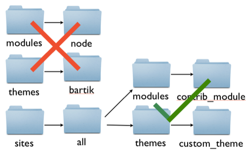
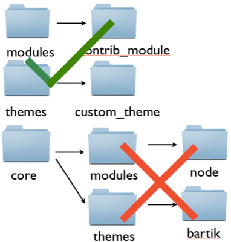

# Drupal 8: What's inside the folder (lesson 1)

## Summary

This lesson provides an overview of the contents of your Drupal 8 installation. Since understanding where to place 

## Lesson

*(Download Drupal 8 from the project page)*
*(We need the D8 alpha tarball here for this to be accessible w/o git.)*

*(Open the folder)*

*(Highlight subdirectories onscreen)* The root of our new copy of Drupal 8
contains several subdirectories:

* core
* modules
* profiles
* sites
* themes

### Where to place site modules and themes

*(Open the `modules` directory)* If you open the `modules` directory,
you'll notice right away that it's empty. So are the `themes` and `profiles`
directories. In previous versions of Drupal, these directories contained the
modules, themes, and profiles used by Drupal core which was often a stumbling point for people getting started with Drupal who took the obvious action of puttin their site specific modules and themes in the corresponding directories.

*(Open the `core` directory)* Drupal 8 has a new `core` subdirectory
instead. It contains all core's modules, themes, libraries, and profiles. This
makes it easier to see which files are part of Drupal core and allowing for placement of custom code within the `modules` and `themes` root directories without the unexpected consequence of inadvenrtantly hacking core.

In previous versions of Drupal, modules and themes always had to be placed
inside the `sites` directory.

In Drupal 8, it is now safe to place your contributed modules, themes, and
profiles in these root directories. Just be sure not to modify the contents of
the `core` folder.

In addition to the root `modules` and `themes` directory you can also place your custom and contributed modules within the sites directory just like you could in prior versions of Drupal. In a multisite configuration the code in the root `modules` and `themes` directories will be treated like `sites/all/modules` and `sites/all/themes` in the past. That is, the modules loaded in the root directory will be available to all sites in a multisite installation.

The README.txt files contained within each of these directories also documents this information.

### The `core` directory

In Drupal 8 all most all of the code that makes up Drupal core is contained within the root `core` directory. Making it much more apparent that if you're dealing withing something within this directory you're dealing with Drupal core and not your site specific code. Adding code to, or modifying the code in this directory is a clear sign that you're now making changes to Drupal core.

*(Open the `core` directory)* Let's take a closer look at the contents of the
`core` directory. It has a number of different files and subdirectories. The
subdirectories it contains are:

* includes
* lib
* misc
* modules
* profiles
* scripts
* tests
* themes
* vendor

*(Highlight `modules`, `profiles`, and `themes`)* We've already mentioned that
the modules, themes, and profiles directories contain core's modules, profiles,
and themes.

*(Highlight the `includes` directory)* The `includes` directory contains files which define the various Drupal API functions that are not part of any specific core module.

*(Highlight the `lib` directory)* The `lib` directory contains class definitions. In
Drupal 8, each class is in a separate file. We'll talk about the contents of
this directory more in [lesson 3](../lesson_3/index.md).

*(Highlight the `misc` directory)* The `misc` directory, as in previous versions of Drupal is a bit of a dumping ground for various CSS, JavaScript and Image assets that are not theme specific.

*(Highlight the `scripts` directory)* The `scripts` directory contains some helpful shell scripts for interacting with your Drupal install.

*(Highlight the `tests` directory)* The `tests` directory contains various unit tests for Drupal core.

*(Highlight the `vendor` directory)* Drupal 8 relies heavily on code from various other open-source projects and the `vendor` directory contains that code keeping it seperate from the Drupal specific code and matching the standard Composer convention.

*(Higlight & maybe open the `compser.json` file)* Mention it's existence because it's new and potentially confusing.

-- Talk about any big consequences this has for module developers and/or for people migrating from D7 to D8 --

## What's next?
*

## References
* [Most Drupal core files now live in a "core" subdirectory](https://drupal.org/node/1327978)
* [Use Composer to handle Drupal Core PHP dependencies](https://drupal.org/node/1764330)
