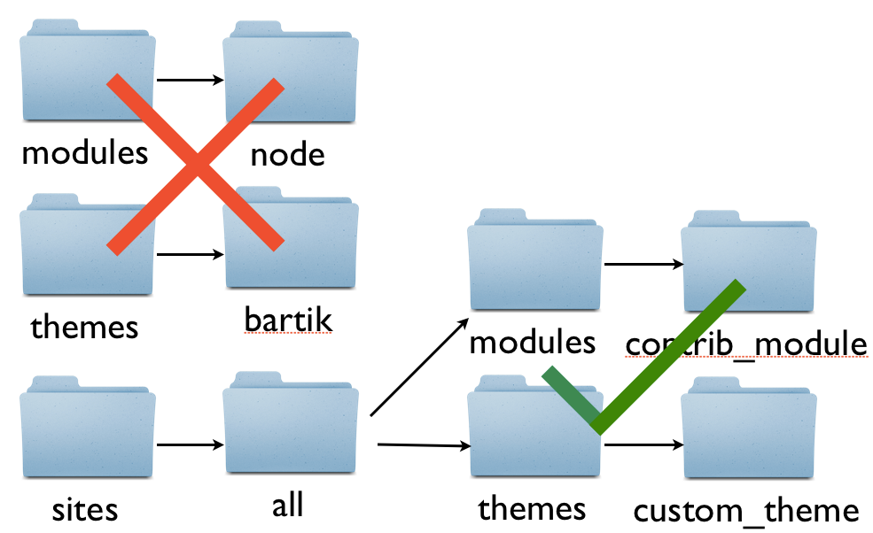
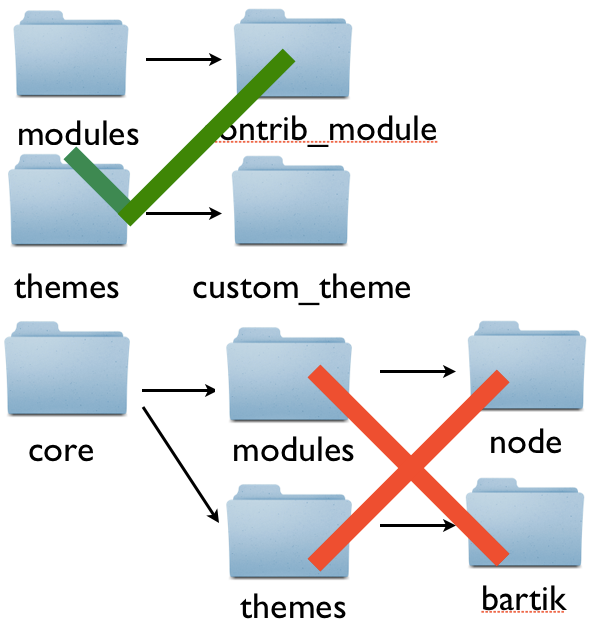

# Drupal 8: What's inside the folder (lesson 1)

## Summary

This lesson provides an overview of the contents of your Drupal 8 installation.

## Lesson

*(Download Drupal 8 from the project page)*
*(We need the D8 alpha tarball here for this to be accessible w/o git.)*

*(Open the folder)*

*(Highlight subdirectories onscreen)* The root of our new copy of Drupal 8
contains several subdirectories:

* core
* modules
* profiles
* sites
* themes

*(Open the `modules` directory)* If you open the `modules` directory,
you'll notice right away that it's empty. So are the `themes` and `profiles`
directories. In previous versions of Drupal, these directories contained the
modules, themes, and profiles used by Drupal core.

*(Open the `core` directory)* Drupal 8 has a new `core` subdirectory
instead. It contains all core's modules, themes, libraries, and profiles. This
makes it easier to see which files are part of Drupal core.

*(Open the root directory again)* In previous versions of Drupal, modules and
themes always had to be placed inside the `sites` directory.

In Drupal 8, it is now safe to place your contributed modules, themes, and
profiles in these root directories. Just be sure not to modify the contents of
the `core` folder.

## What's next?
*

## References
* [Most Drupal core files now live in a "core" subdirectory](https://drupal.org/node/1327978)

